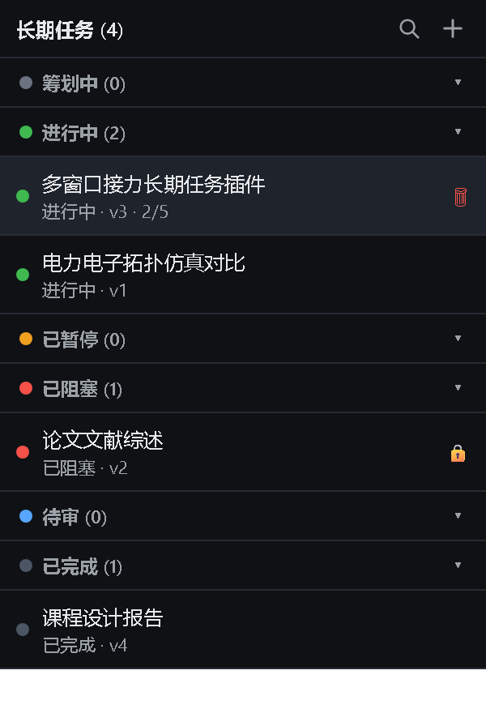

# dsh-lt-tasks

Multi-window, long-running task management plugin for [DeepSeek Harness](https://github.com/deepseek-ai/deepseek-harness).

A task is a persistent folder (11 archived documents + a minimal handoff index + lock), **not bound to any window**. Multiple windows advance the same task via a minimal handoff index, minimizing long-context / forgetting.

[中文](README.md) · English

## Screenshot



## Features

- **11 business documents + meta**: `meta` (machine metadata) + `handoff / goal / frozen / tasklist / next / progress / refs / index / errors / blockers / review` (11 business docs) — one concern per file.
- **Minimal handoff**: `handoff.md` stores only **full document paths** + a one-line "next", so the next agent reads on demand instead of reading everything.
- **Multi-window handoff**: any window says "advance task X" → reads the handoff index → locates docs → works → saves.
- **6-state machine**: planning / active / paused / blocked / review / completed.
- **Concurrency lock**: `.lock` (session + timestamp), single window at a time, configurable expiry.
- **Read-only references**: copied into `refs/` then marked read-only (Windows attribute).
- **Directory index**: `index.md` / `refs.md` record absolute file paths + Markdown headings, so you can jump straight to a section.
- **Progress tracking**: tasklist checkboxes auto-count done/total.
- **Frontend view**: a "Tasks" tab in the left sidebar — grouped collapsible list, search, slide-in detail drawer, inline editing, status dropdown.
- **Task↔session link**: advancing records the session; opening a task detail auto-opens that conversation.
- **Composer prefill**: the "＋" new-task button and the detail "＋ new chat" button prefill a hint into the composer (`请帮我新建一个长期任务：` / `推进长期任务 xxx`) without auto-sending; you add your requirements and send.
- **Self-growth**: on completion, generates an archive suggestion for confirmation before writing to skills.

## Install

1. Place this package where the profile can resolve it (e.g. `~/.dsh/profiles/node_modules/dsh-lt-tasks`).
2. Append to the profile `cordis.patch.yml`:

```yaml
- insert:
    - id: dsh-lt-tasks
      name: 'dsh-lt-tasks'
```

3. Restart the dsh web backend.

## Config

| Var | Default | Meaning |
|---|---|---|
| `DSH_LT_TASKS_ROOT` | `~/.dsh/lt-tasks/` | task library root (management docs) |
| `DSH_LT_TASKS_LOCK_TTL` | `24` | lock expiry (hours) |

## Tools (9)

| Tool | Purpose |
|---|---|
| `create_task` | create task (planning); optional `refPath` copies references into `refs/` read-only |
| `list_tasks` | list tasks with status |
| `get_task` | read archive (meta + 9 business docs; blockers/review read separately) |
| `advance_task` | lock, mark active, return the minimal handoff index |
| `save_progress` | save summary/audit trail/blockers (auto-marks blocked)/review, bump version, unlock |
| `pause_task` / `resume_task` | pause (unlock) / resume |
| `complete_task` | complete, generate archive suggestion |
| `delete_task` | delete a task (irreversible) |

Typical flow: `create_task` → (plan) → `advance_task` → work → `save_progress` → … → `complete_task`.

## Directory layout

```
<DSH_LT_TASKS_ROOT>/<task>/
  meta.md / handoff.md / goal.md / frozen.md / tasklist.md / next.md /
  progress.md / refs.md / index.md / errors.md / blockers.md / review.md
  .lock
  works/v1, v2, ...   # outputs per iteration (shared across windows)
  refs/               # references (read-only)
```

## Development

```
plugins/lt-tasks/
├── lib/index.js      # host entry: tools + HTTP routes
├── lib/store.js      # task storage, state machine, directory index, atomic writes
├── lib/lock.js       # concurrency lock
├── lib/readonly.js   # read-only attribute
├── lib/tools.js      # 9 model tools
├── lib/routes.js     # HTTP API (/lt-tasks/*)
├── lib/client.js     # frontend "Tasks" view
├── test.mjs          # core logic tests (node test.mjs)
├── package.json
└── cordis.patch.yml
```

- Host changes require a dsh backend restart; client changes require a page refresh.
- Tests: `node test.mjs`.

## License

MIT
